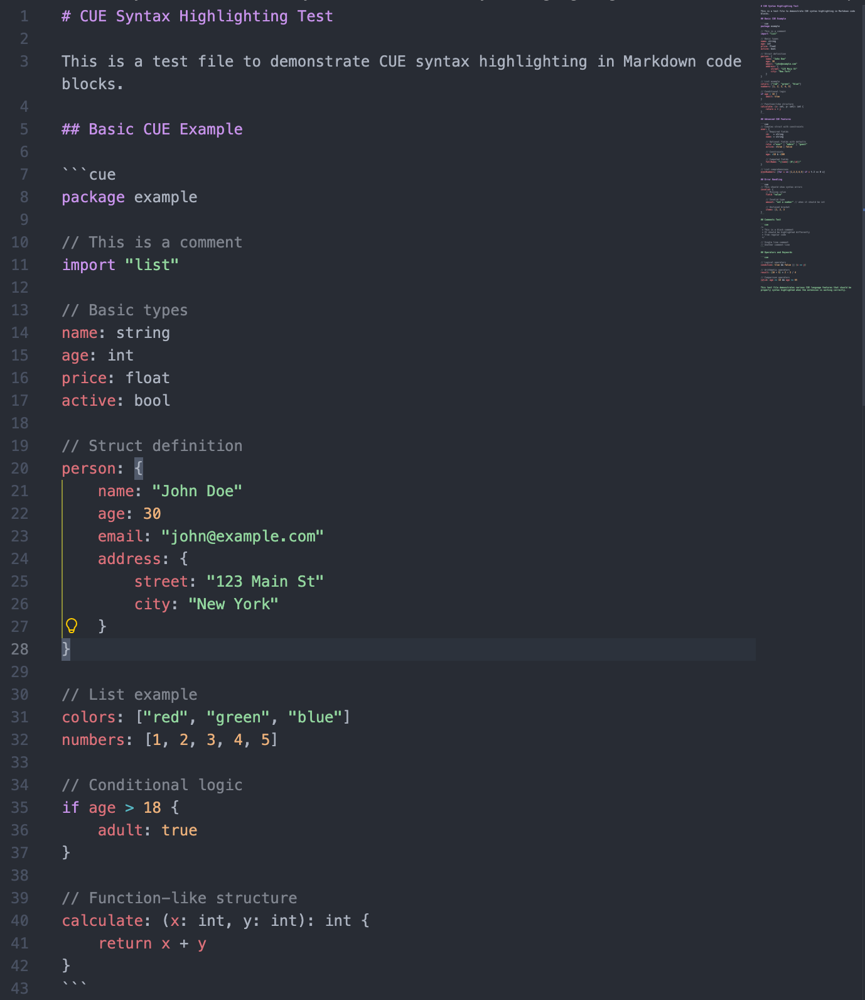

# VSCode CUE in Markdown Syntax Highlighting

A Visual Studio Code extension that provides CUE language syntax highlighting within Markdown code blocks.

## Overview

This extension enables proper syntax highlighting for CUE (Configure, Unify, Execute) language code when used within Markdown code blocks in VSCode. It automatically detects CUE code blocks and applies appropriate syntax highlighting rules.



## Features

- **Automatic CUE Detection**: Automatically recognizes CUE code blocks in Markdown files
- **Full Syntax Highlighting**: Provides complete syntax highlighting for CUE language features including:
  - Keywords (`package`, `import`, `if`, etc.)
  - Data types (`string`, `int`, `float`, `bool`)
  - Operators (`&&`, `||`, `==`, `>`, `<`, etc.)
  - Comments (both single-line `//` and multi-line `/* */`)
  - Struct definitions and field declarations
  - Constraints and computed fields
  - List comprehensions and advanced CUE features

## Installation

1. Install from the Visual Studio Code Marketplace
2. Or install manually by cloning this repository and running:
   ```bash
   npm install
   vsce package
   ```

## Usage

Simply use CUE code blocks in your Markdown files:

````markdown
```cue
package example

// This will be syntax highlighted
person: {
    name: "John Doe"
    age: 30
    active: true
}
```
````

The extension automatically detects the `cue` language identifier and applies appropriate syntax highlighting.

## Supported CUE Features

The extension supports highlighting for:

- **Basic Syntax**: Package declarations, imports, comments
- **Data Types**: `string`, `int`, `float`, `bool`, and custom types
- **Structures**: Nested objects, field declarations, constraints
- **Operators**: Logical (`&&`, `||`), comparison (`==`, `!=`, `>`, `<`), arithmetic
- **Advanced Features**: Conditional logic, computed fields, list comprehensions
- **Error Handling**: Syntax errors are highlighted appropriately

## Technical Implementation

The extension uses VSCode's grammar injection system to:

1. Detect Markdown code blocks with `cue` language identifier
2. Inject CUE syntax rules into the Markdown context
3. Apply the standard CUE language syntax highlighting within those blocks

Key files:
- `syntaxes/cue-injection.json`: Grammar injection rules
- `syntaxes/cue.tmLanguage.json`: CUE syntax definition
- `extension.js`: Main extension activation logic

## Development

To contribute or modify this extension:

1. Clone the repository
2. Install dependencies: `npm install`
3. Make your changes
4. Test with the provided `test-cue-syntax.md` file
5. Build: `npm run compile`
6. Package: `npm run package`

## License

MIT License

## Contributing

Contributions are welcome! Please open issues for bugs or feature requests, and submit pull requests for improvements.

## Support

For issues or questions, please open a GitHub issue on the project repository.

---

**Enjoy better CUE syntax highlighting in your Markdown documentation!**
